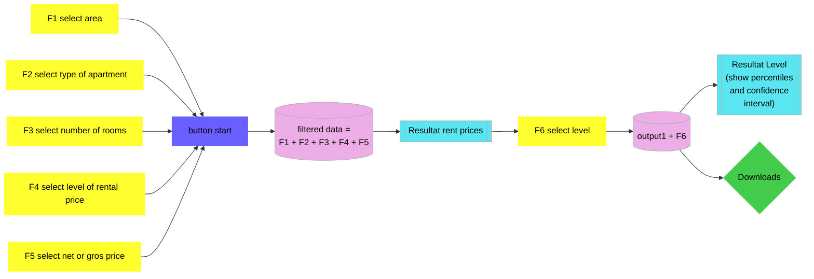

# MPE-Tool
Shiny app for MPE tool (MietPreisErhebung). By using this application you agree to the [disclaimer](https://www.stadt-zuerich.ch/prd/de/index/statistik/publikationen-angebote/datenbanken-anwendungen/mietpreiserhebung/disclaimer.html). You can find the documentation of the methodology [here](https://www.stadt-zuerich.ch/prd/de/index/statistik/publikationen-angebote/publikationen/methodenbericht/Methodenbericht_Mietpreiserhebung.html).

The MPE application on the website of [Statistik Stadt Zürich](https://www.stadt-zuerich.ch/prd/de/index/statistik/publikationen-angebote/datenbanken-anwendungen/mietpreiserhebung.html) shows estimated average rental prices in the city of Zurich (including prices per square meter, median and the respective quantiles) of 2-, 3- and 4-room rental apartments as of the date of April 1, 2022. The estimated rental prices are based on a stratified sample. On the one hand this sample consist of a non-representative ad hoc sample established over several years, which is collected quarterly (net rental prcies for 50,572 apartments). On the other hand, it consists of a one-time random sample of all remaining rental apartments, which guarantees the necessary representativeness (net rental prices for 5236 apartments).

In addition to the number of rooms, the rents can also be filtered according to different spatial levels, and in some cases also according to two different categories of property developers (profit oriented and non-profit oriented) and market indicators (tenancies categorized by duration).

The MPE does not record any information on the fit-out standard, condition, exposure, noise situation or other rent-relevant factors for the apartments.

The data is obtained from the Open Data portal of the city of Zurich and is available [here](https://data.stadt-zuerich.ch/dataset/bau_whg_mpe_mietpreis_raum_zizahl_gn_jahr_od5161).

## Glossary
### Rental apartments in the population
The population in the MPE consists of all 2-, 3- and 4-room apartments in the city of Zurich that are offered for rent unfurnished and without specified restrictions on the possible tenant base. For example, apartments with restrictions on possible tenant base are apartments in retirement homes, student apartments such as those of the [Studentische Wohngenossenschaft Zürich (WOKO)](https://www.woko.ch/), as well as service and staff apartments of asylums, hospitals, hospitality industry and the like. Furnished apartments are apartments that are known to be rented out on a commercial basis for a limited period of time.

### Non-profit status
First of all, non-profit apartments include all apartments owned by the City of Zurich or by cooperatives, associations or foundations and are managed according to the principle of cost rent. Furthermore, the category of non-profit includes apartments whose ownership is considered non-profit in the broader sense and does not rent its rental properties exclusively according to the principle of cost rent (certain foundations, associations and stock corporations). The cost rent is used to pay the interest on debts and the administrative costs, as well as to ensure the maintenance and value retention of the properties and the provisions for renewal. In the medium to long term, the cost rent results in lower rents than for comparable properties on the housing market.

### Market indicators
The market indicators characterize the type of tenancy. The following five categories are distinguished:

- New built rents. Rents in buildings that are no more than two years old.
- Reference rents: Tenancy with duration ≤ 2 years in older buildings.
- Existing rents 2-10 years: Tenancy with duration > 2 and ≤ 10 years.
- Existing rents 11-20 years: Tenancy with duration > 10 and ≤ 20 years.
- Existing rents over 20 years: Tenancy with duration > 20 years.

### spatial units for queries on property owneship
Since it is not possible to differentiate rents by property ownership (profit oriented and non-profit oriented) in small city quarters due to insufficient data (small sample sizes), the city districts 1, 2, 5 and 8 are not broken down into individual quarters, and the following groups of quarters were formed: Fluntern and Hottingen, Hirslanden and Witikon, Alt-Wiedikon and Friesenberg, werd and Langstrasse, and Saatlen and Schwammendingen Mitte.

### spatial unit: city quarters group
This spatial unit was formed on the basis of the distinction according to the two property ownerships. See «spatial units for queries on property ownership».

### Median
The median is the value that devides rental prices into two equal halves, i.e. one half of the rental prices is smaller than the median and the other half is larger.

### Quantiles
A quantile specifies how many of the estimated values are lower or equal to the specified quantile limit. Example: The 25% quantile states that 25% are lower or equal to the specified value.

### Confidence intervals
The estimated prices are underlaid with the 95% confidence intervals. These denote the range that, given an infinite repetition of a random experiment, includes the true value of the population with a probability of 95%. In the MPE, citywide 95% confidence intervals are approximately 4 percent of the reported median prices and means (absolute width of confidence interval divided by estimated value). For smaller spatial units (e.g. quarters), the uncertainties are higher; the confidence intervals of the reported values are in the range of 4 to 8 percent and may increase to close to 20 percent in some cases.

## Architecture

