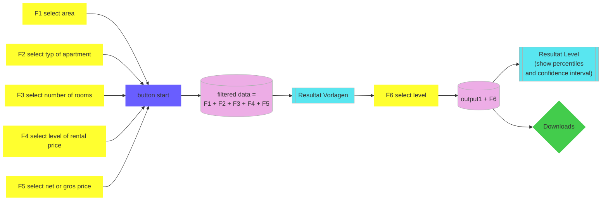

# MPE-Tool
Shiny app for MPE Tool

# Architektur

```mermaid
flowchart LR;
  f1[F1 select area]:::filter --> button[button start]:::button
  f2[F2 select typ of apartment]:::filter --> button
  f3[F3 select number of rooms]:::filter --> button
  f4[F4 select level of rental price]:::filter --> button
  f5[F5 select net or gros price]:::filter --> button
  button --> output1[(filtered data = \nF1 + F2 + F3 + F4 + F5)]:::data
  output1 --> results1[[Resultat Vorlagen]]:::result
  results1 --> f6[F6 select level]:::filter
  f6 --> output2[(output1 + F6)]:::data
  output2 --> results2[["Resultat Level \n(show percentiles \nand confidence interval)"]]:::result
  output2 --> downloads{Downloads}:::download
  
  classDef filter fill:#ffff2f,stroke:#ffff2f;
  classDef button fill:#695eff,stroke:#695eff;
  classDef data fill:#edade6,stroke:#acb0b0;
  classDef result fill:#59e6f0,stroke:#acb0b0;
  classDef download fill:#43cc4c,stroke:#43cc4c;
```
